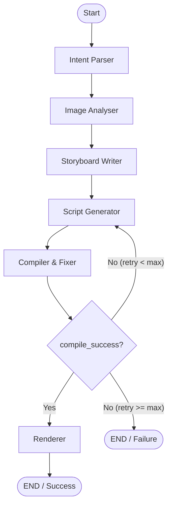
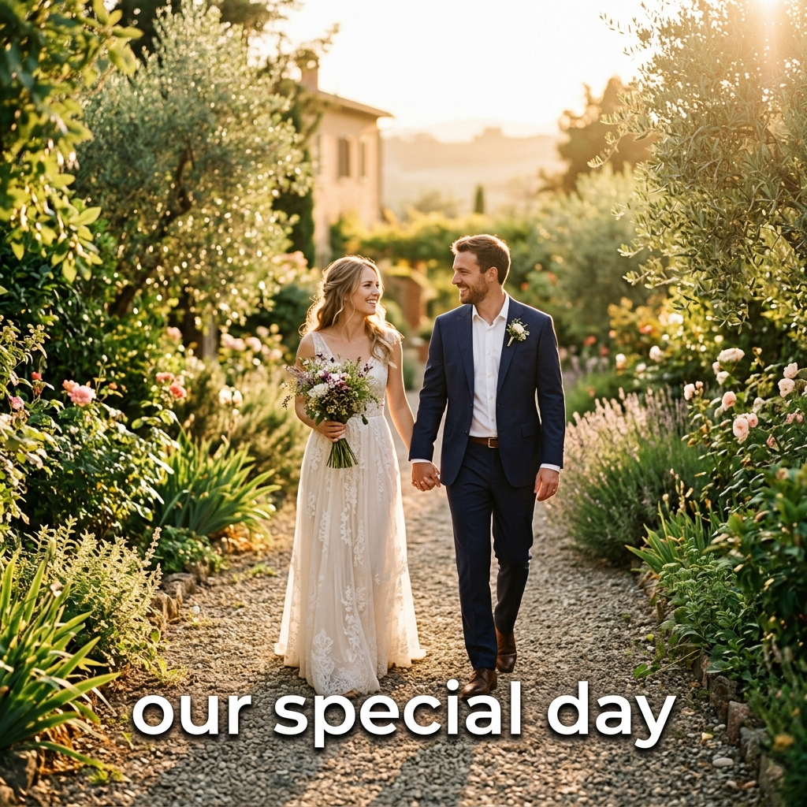

# FotoOwl AI Take-home: Image-to-Video Multiagent Pipeline

This repository implements a multiagent system orchestrated using **LangGraph** to convert a folder of event photos and a short text prompt into a rendered **Remotion** video reel.

## Pipeline Architecture

The workflow is modeled as a StateGraph with a double-loop compiler self-correction mechanism:



## Project Structure

- `agents/`: The five pipeline agents:
  - `intent_parser.py`: Parses the raw user prompt into a structured creative brief.
  - `image_analyser.py`: Scores image quality and relevance using a vision-capable model. Falls back to heuristic descriptions when the configured key does not support vision.
  - `storyboard_writer.py`: Creates a narrative storyboard with transitions, animations, and timing.
  - `script_generator.py`: Generates the Remotion TypeScript composition from the storyboard.
  - `compiler_fixer.py`: Compiles the TSX script via `tsc` and runs an iterative LLM fix loop on errors.
  - `renderer.py`: Invokes the Remotion CLI to render the final MP4.
- `graph/`: LangGraph StateGraph orchestrator.
- `models/`: Pydantic state schemas and the **model routing layer**:
  - `model_router.py`: Central dispatch — `get_intent_model()`, `get_vision_model()`, `get_storyboard_model()`, `get_script_model()`, `get_fixer_model()`.
  - `openai_provider.py`: Cached OpenAI and Anthropic client factories.
  - `groq_provider.py`: Cached Groq (OpenAI-compatible) client factory.
- `rag/`: ChromaDB local vector store with style guides and Remotion API reference snippets.
- `remotion/`: The React-based Remotion video composition project.
- `tests/`: Full mocked unit and integration test suite (14 tests).
- `main.py`: The pipeline CLI entry point.

## Model Selection & Configuration

### How the Model Router Works

No model or provider is hard-coded inside any agent. Instead, every agent calls a function from `models/model_router.py` (e.g. `get_intent_model()`) that returns a `(client, model_name)` tuple. The router reads `OPENAI_BASE_URL` and `OPENAI_API_KEY` at runtime to decide which provider to use, then falls back to sensible defaults.

This means you can **switch the entire pipeline from OpenAI → Groq → any OpenAI-compatible provider** by changing two lines in `.env` — with no code changes.

### Default Model Assignments

The table below shows the defaults when using each provider. Every value in the **Env Var** column can be overridden independently:

| Agent | Env Var | OpenAI Default | Groq Default | Rationale |
| :--- | :--- | :--- | :--- | :--- |
| **Intent Parser** | `INTENT_PARSER_MODEL` | `gpt-4o-mini` | `llama-4-scout-17b-16e-instruct` | Simple classification/extraction. A small, fast model is sufficient and keeps cost minimal. |
| **Image Analyser** | `IMAGE_ANALYSER_MODEL` | `gpt-4o` | `llama-4-scout-17b-16e-instruct` | Requires vision capability. A capable multimodal model is needed for spatial and aesthetic understanding. Falls back to text heuristics when the active key does not support vision (e.g. Groq `gsk_` keys). |
| **Storyboard Writer** | `STORYBOARD_MODEL` | `gpt-4o-mini` | `llama-4-scout-17b-16e-instruct` | Pure structured reasoning — images are already described, so no vision is needed. RAG-provided style guides compensate for reduced model capability. |
| **Script Generator** | `SCRIPT_GENERATOR_MODEL` | `claude-sonnet-4-5` *(Anthropic)* | `llama-4-scout-17b-16e-instruct` | Most complex task: long-form TypeScript with niche framework APIs. Claude Sonnet is preferred when `ANTHROPIC_API_KEY` is set; otherwise falls back to the OpenAI/Groq client. |
| **Compiler & Fixer** | `COMPILER_FIXER_MODEL` | `gpt-4o-mini` | `llama-4-scout-17b-16e-instruct` | Targeted diff repair from structured error traces. Fast, cheap, iterative — a smaller model is ideal. |

## Setup and Installation

1. Create a Python 3.11+ virtual environment and install the package:
   ```bash
   python3 -m venv .venv
   source .venv/bin/activate
   pip install --upgrade pip
   pip install -e ".[dev]"
   ```

2. Install Remotion project dependencies:
   ```bash
   cd remotion
   npm install
   ```

3. Create a `.env` file from the template and fill in your keys:
   ```bash
   cp .env.example .env
   ```

## Configuration Reference

All configuration is driven by environment variables in `.env`. None of these have to match a specific provider — the model router adapts automatically.

```bash
# ── Provider ──────────────────────────────────────────────────────────────────
OPENAI_API_KEY=sk-...               # OpenAI key (or a Groq gsk_... key)
OPENAI_BASE_URL=https://api.groq.com/openai/v1   # Set to redirect to Groq / any OpenAI-compatible API
ANTHROPIC_API_KEY=sk-ant-...        # Optional. If set, Script Generator uses Claude Sonnet.

# ── Model overrides (optional — defaults shown for OpenAI provider) ──────────
INTENT_PARSER_MODEL=gpt-4o-mini
IMAGE_ANALYSER_MODEL=gpt-4o
STORYBOARD_MODEL=gpt-4o-mini
SCRIPT_GENERATOR_MODEL=claude-sonnet-4-5
COMPILER_FIXER_MODEL=gpt-4o-mini

# ── Pipeline settings ────────────────────────────────────────────────────────
IMAGES_DIR=./images                 # Source photos directory
MAX_IMAGES=12                       # Max images to analyse (cost control)
MAX_RETRIES=3                       # Compiler retry limit
OUTPUT_DIR=./out                    # Output folder for MP4, storyboard, and state

# ── Remotion ──────────────────────────────────────────────────────────────────
REMOTION_PROJECT_DIR=./remotion

# ── RAG ───────────────────────────────────────────────────────────────────────
CHROMA_PERSIST_DIR=./chroma_db

# ── Tracing (optional) ────────────────────────────────────────────────────────
LANGSMITH_API_KEY=lsv2_...
LANGSMITH_TRACING=false
LANGSMITH_PROJECT=foto-owl-pipeline
```

### Example: Switching to Groq

To run the full pipeline on Groq (no Anthropic key required):
```bash
OPENAI_API_KEY=gsk_your_groq_key
OPENAI_BASE_URL=https://api.groq.com/openai/v1
INTENT_PARSER_MODEL=llama-4-scout-17b-16e-instruct
STORYBOARD_MODEL=llama-4-scout-17b-16e-instruct
SCRIPT_GENERATOR_MODEL=llama-4-scout-17b-16e-instruct
COMPILER_FIXER_MODEL=llama-4-scout-17b-16e-instruct
# IMAGE_ANALYSER_MODEL is unused on Groq — vision falls back to text heuristics.
```

> **Note:** When `OPENAI_API_KEY` starts with `gsk_`, the Image Analyser automatically skips the vision API call and uses heuristic image descriptions instead, since Groq does not support base64 image uploads.

## Usage

### 1. Seed the RAG Store
Before running the pipeline, load the reference documentation and style guides into the vector store:
```bash
python main.py --seed-rag
```

### 2. Run the Pipeline
To generate a video from a folder of images, pass a prompt and the images directory:
```bash
python main.py --prompt "Cinematic wedding reel, slow and emotional, warm tones" --images-dir . --max-images 10
```

To run a sports reel from pickleball photos:
```bash
python main.py --prompt "Upbeat sports highlights, high energy, fast cuts" --images-dir . --max-images 12
```

The final rendered video will be saved in the `out/` folder (e.g. `out/Wedding_Highlights.mp4`).

## Test Suite
The repository includes a complete test suite with unit tests for every agent and integration tests for the full LangGraph loop. All external API calls and rendering steps are mocked so you do not need active API keys or credentials to run them:
```bash
pytest tests/ -v
```

## Pipeline Artifacts & Visuals

Here is a visual overview of the pipeline's outputs and structures:

### 1. Example Rendered Video Frame
Below is an example frame showing a wedding scene with the opening text overlay:



### 2. Output Folder Structure
After execution, the `out/` folder is structured as follows:
```text
out/
├── Wedding_Highlights.mp4    # Rendered MP4 video output (11.3 MB)
├── storyboard.json           # Narrative storyboard driving the rendering
├── EventReel.tsx             # Generated Remotion TypeScript script
└── pipeline_state.json       # Full serialized state from the LangGraph run
```

### 3. Example Storyboard Configuration (`storyboard.json`)
The generated storyboard contains metadata and scene descriptions mapping images to transitions/animations:

```json
{
  "title": "Wedding Highlights",
  "total_duration_seconds": 45.0,
  "narrative_arc": "open → build → close",
  "scenes": [
    {
      "order": 0,
      "image_path": "AHD_6008.jpg",
      "duration_seconds": 6.0,
      "caption": null,
      "transition_in": "fade",
      "animation": "ken_burns",
      "scene_note": "Establishing moment"
    },
    {
      "order": 1,
      "image_path": "AHD_6020.jpg",
      "duration_seconds": 5.0,
      "caption": "Their love shines bright",
      "transition_in": "dissolve",
      "animation": "zoom_in",
      "scene_note": "Building emotional resonance"
    },
    {
      "order": 2,
      "image_path": "AHD_6024.jpg",
      "duration_seconds": 6.0,
      "caption": null,
      "transition_in": "fade",
      "animation": "static",
      "scene_note": "Climactic moment"
    }
  ],
  "opening_text": "A moment to remember",
  "closing_text": "Forever begins"
}
```
